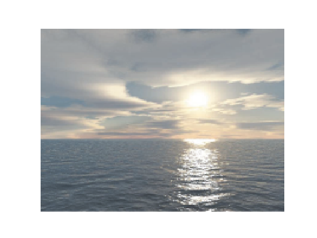
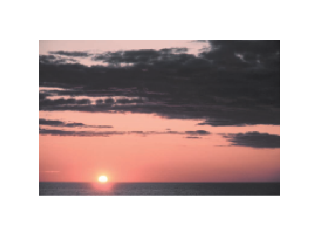
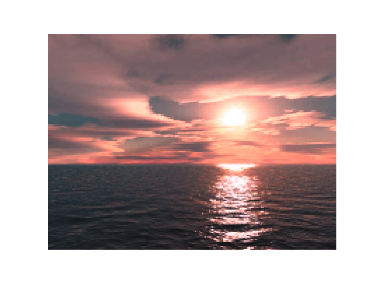
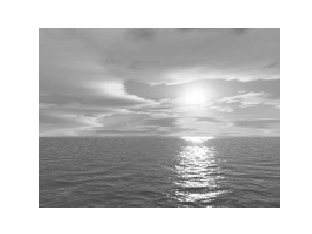
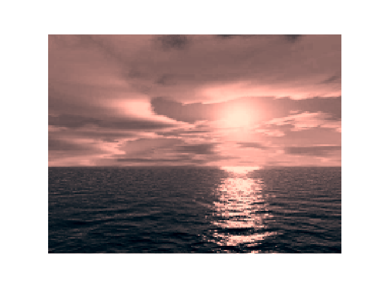
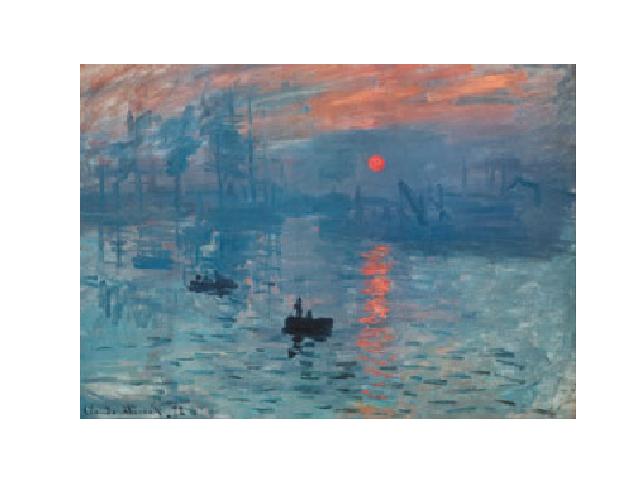
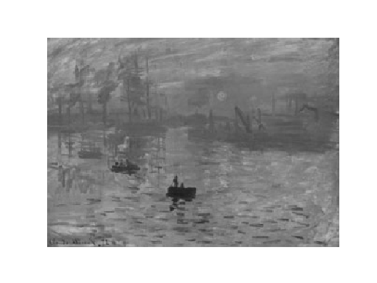
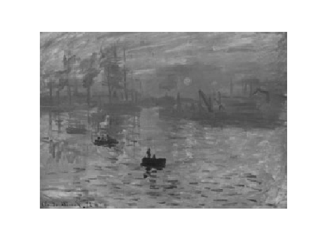
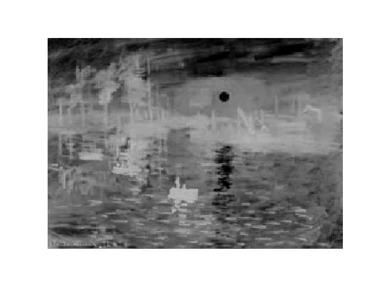

# 作业1：图像颜色变换

**摘要：**在图像处理的领域内，色彩迁移及上色等问题一直是一个经久不衰的话题，许多文章都对这些问题进行了深入的剖析与解释，也有丰富的成果，这些成果在图像领域得到了广泛的应用。本次作业对该领域中三个问题：色彩迁移、给灰图上色、图像的灰度处理三个方向进行了研究。对于前两个问题，建立数学模型表示两张彩图的像素颜色相似性进行建模，而对最后一个问题即为一个降维算法，可以很自然的想到通过一个三维到一维的映射来对图片进行黑白化，同时我们还对其进行了PCA降维处理，并将两种方法进行了对比。

**关键词：**色彩迁移；图像上色；灰度处理；

## 1.前言

​		对于色彩迁移的问题(Color Transfer)，根据Color Transfer Between Images<sup>[1]</sup>中所述，可以使用一种十分简单的方法进行迁移。首先我们要进行色彩空间的转换，因为在RGB空间中，三个色彩红绿蓝三个色彩是相互关联的，即该色彩空间中的基并不相互正交，我们需要找到一个基于人类视觉系统的一组相互正交的基，该空间被称为 $ l$ $ \alpha $ $ \beta$ 空间，该空间消除了坐标轴间的相关性，使得在人类视觉中达到最好的效果。转换空间后，通过对两图的统计量——均值及标准差的操作进行颜色的修正迁移，即可得到很好的效果。
​		而对于图像上色问题，首先的思路便是能否通过上述的色彩迁移的方式，将一张彩图迁移到一张灰白图像中，但这会遇到灰白图$ \alpha $ $ \beta$ 空间分量标准差为0的情况，这就会导致转换后的这些分量发散。为了避免这些错误，我们回到RGB空间进行操作，也能得到不错的效果
​		最后对于图片灰白化，我们对两种方法——映射法及PCA进行了对比。

## 2.模型
### 颜色迁移：
​		对两张图片的像素颜色相似性进行建模：将像素矩阵转换到 $ l$ $ \alpha $ $ \beta$ 空间对  $ l$ $ \alpha $ $ \beta$ 去中心化后除以其相应的标准差，使得两张图的该值的差最小即可视作两张图的色彩相近。

​		根据Color Transfer Between Images<sup>[1]</sup>一文，我们可以得到求解步骤：

1. 先将RGB空间转移到XYZ空间转换矩阵为：$$\left[\begin{matrix}
	0.5141 & 0.3239 & 0.1604\\
   	0.2651 & 0.6702 & 0.0641\\
   	0.0241& 0.1228 & 0.8444\\
   	\end{matrix}\right]$$
2. 将转换到的XYZ空间的向量转换到LMS空间，转换矩阵为：$$\left[\begin{matrix}0.3897 & 0.6890 & 0.0787\\-0.2298 & 1.1834 & 0.0464\\0.0000 & 0.0000 & 1.0000\end{matrix}\right]$$

3. 再将LMS空间中每个分量取log，得到$L$ $M$ $S$空间，最后转换为 $ l$ $ \alpha $ $ \beta$ 空间，转换矩阵为：                                  							$$\left[\begin{matrix}
     	\frac{1}{\sqrt{3}} & 0 & 0\\
      	 0 & \frac{1}{\sqrt{6}} & 0\\ 
      	 0 & 0 & \frac{1}{\sqrt{2}}\\
      	 \end{matrix}\right]\left[\begin{matrix}
      	 0.3897 & 0.6890 & 0.0787\\
        	-0.2298 & 1.1834 & 0.0464\\ 
        	0.0000 & 0.0000 & 1.0000\\
        	\end{matrix}\right]$$
   即可得到 $ l$ $ \alpha $ $ \beta$ 空间中的像素矢量。

​		最后通过统计的方法进行颜色的迁移，具体方法如下：

1. 先将像素矢量组去中心化：

​                                                            $l^*=l -\bar{l}$

​															$\alpha^*=\alpha -\bar{\alpha}$

​															$\beta^*=\beta -\bar{\beta}$

2. 然后按方差的比例进行缩放：


​															$l^*=\frac{\sigma^l_t}{\sigma^l_s}l^*$	

​															$\alpha^*=\frac{\sigma^\alpha_t}{\sigma^\alpha_s}\alpha^*$	

​															$\beta^*=\frac{\sigma^\beta_t}{\sigma^\beta_s}\beta^*$

3. 最后再将$l\alpha\beta$空间通过乘以上述矩阵的逆矩阵回到RGB空加即可。

### 图片上色：

​		我们可以用与上面相同的方式给灰图上色，但要注意的是，我们不能再转换到$l\alpha\beta$空间因为在该空间内灰白图只会保留其亮度信息即$l$分量的信息，剩下两个分量的方差退化为0，这样就会使得转换过程发散。我们可以回到原有的RGB空间进行如上相同的操作，虽然降低效果但经过实测也不失为一种好方法。

### 图片灰白化：

​		首先我们通过公式映射法找到一个好的三维到一维的映射函数，首先可以想到的便是直接RGB三者取平均：

​													$$ P=\frac{1}{3}*(R+G+B)$$

同时在网上也查到了更好的公式也是MATLAB对图像灰白化的方式:

​												$$P=0.299*Red+0.587*Green+0.114*Blue $$

最后我们还采取了PCA降维的方式对图片进行了处理，具体的求解步骤如下：

1. 将图像每个像素点矢量作为列向量组成一个3×n的矩阵A，n为该图像素个数。
2. 对A的每一行进行去中心化即减去该行均值
3. 得到协方差矩阵$C = \frac{1}{n}AA^T$
4. 求出C的特征值与特征向量**并将其标准正交化**并找到特征值最大的特征值对应的特征向量$\vec{x}$
5. 对每个像素点矢量$\vec{a}$进行$\vec{x}$方向上的投影即$\vec{a} \cdot \vec{x}$得到的实数即可表示图片灰度。

​		本作业中我们使用SVD分解来得到其协方差的特征向量，观察可知以上最优化步骤与n的具体值并没有关系，我们只需要找A的左奇异特征向量，我们可以直接对A进行奇异值分解[U,sigma,VT] = SVD(A)，并取U的第一列即可得到$\vec{x}$，直接使用numpy中svd即可，更加简单方便。(后来发现会爆内存.....所以还是得老老实实算.....)

## 3.代码

### 图片类的声明：

```python

import matplotlib.pylab as plt
import numpy as np
import math


class PImage:
    def __init__(self, ImagePath):
        self.im = plt.imread(ImagePath)
        self.Image_Width, self.Image_Height, self.RGBLength = self.im.shape

    def showImg(self):
        plt.imshow(self.im, interpolation="none")
        plt.axis('off')  # 去掉坐标轴
        plt.show()  # 弹窗显示图像

    def GetWidth(self):
        return self.Image_Width

    def GetHeight(self):
        return self.Image_Height

    def GetPixelAt(self, x, y):
        return self.im[x, y][0:3]

    def SetPixelAt(self, x, y, c):
        self.im[x, y][0:3] = c

    def GetPixelAverage(self):
        aver = [0] * 3
        sum = [0] * 3
        for x in range(self.Image_Width):
            for y in range(self.Image_Height):
                PColor = self.GetPixelAt(x, y)
                for i in range(3):
                    sum[i] = sum[i] + PColor[i]
        for i in range(3):
            aver[i] = sum[i] / (self.Image_Width * self.Image_Height)
        return aver

    def GetPixelDeviation(self):
        devi = [0] * 3
        color0 = []
        color1 = []
        color2 = []
        for x in range(self.Image_Width):
            for y in range(self.Image_Height):
                PColor = self.GetPixelAt(x, y)
                color0.append(PColor[0])
                color1.append(PColor[1])
                color2.append(PColor[2])
        devi[0] = np.std(color0)
        devi[1] = np.std(color1)
        devi[2] = np.std(color2)
        return devi
    
        def RGB2lab(self):
        RGB2LMS = np.array([[0.3881, 0.5783, 0.0402], [0.1967, 0.7244, 0.0782], [0.0241, 0.1228, 0.8444]])
        LogLMS2lab = np.diag([1 / math.sqrt(3), 1 / math.sqrt(6), 1 / math.sqrt(2)]) @ np.array([[1, 1, 1],
                                                                                                 [1, 1, -2],
                                                                                                 [1, -1, 0]])
        for x in range(self.Image_Width):
            for y in range(self.Image_Height):
                PColor = self.GetPixelAt(x, y)
                PColor = RGB2LMS @ PColor
                PColor = np.log10(PColor)
                PColor = LogLMS2lab @ PColor
                self.SetPixelAt(x, y, PColor)

    def lab2RGB(self):
        lab2LMS = np.array([[1, 1, 1], [1, 1, -1], [1, -2, 0]]) @ np.diag(
            [1 / math.sqrt(3), 1 / math.sqrt(6), 1 / math.sqrt(2)])
        LMS2RGB = np.array([[4.4679, -3.5873, 0.1193], [-1.2186, 2.3809, -0.1624], [0.0497, -0.2439, 1.2045]])
        for x in range(self.Image_Width):
            for y in range(self.Image_Height):
                PColor = self.GetPixelAt(x, y)
                PColor = lab2LMS @ PColor
                PColor = [10 ** PColor[0], 10 ** PColor[1], 10 ** PColor[2]]
                PColor = LMS2RGB @ PColor
                self.SetPixelAt(x, y, PColor)

    def SaveImage(self):
        plt.imshow(self.im, interpolation="none")
        plt.axis('off')  # 去掉坐标轴
        plt.savefig("3.png")

    im = []
    Image_Width = 0
    Image_Height = 0
    RGBLength = 3

```


### 颜色迁移函数：

```python
def color_transform(impath1, impath2):  # 将im2中的颜色风格转移到im1中
    im1 = PImage(impath1)
    im1.showImg()
    im2 = PImage(impath2)
    im2.showImg()
    im1.RGB2lab()
    im2.RGB2lab()
    im1aver = im1.GetPixelAverage()
    im2aver = im2.GetPixelAverage()
    im1devi = im1.GetPixelDeviation()
    im2devi = im2.GetPixelDeviation()
    for x in range(im1.Image_Width):
        for y in range(im1.Image_Height):
            PColor = im1.GetPixelAt(x, y)
            PColor = np.array(PColor) - np.array(im1aver)
            PColor = PColor * np.array(im2devi) / np.array(im1devi)
            PColor = np.array(PColor) + np.array(im2aver)
            im1.SetPixelAt(x, y, PColor)
    im1.lab2RGB()
    im2.lab2RGB()
    im1.showImg()
```

**该函数在类外声明**，将im2中的颜色风格转移到im1中

### 图片上色函数：

```python
    def colorGrey(impath1, impath2):  # 用im2中的颜色为im1上色
        im1 = PImage(impath1)
        im1.showImg()
        im2 = PImage(impath2)
        im2.showImg()
        im1aver = im1.GetPixelAverage()
        im2aver = im2.GetPixelAverage()
        im1devi = im1.GetPixelDeviation()
        im2devi = im2.GetPixelDeviation()
        for x in range(im1.Image_Width):
            for y in range(im1.Image_Height):
                PColor = im1.GetPixelAt(x, y)
                PColor = np.array(PColor) - np.array(im1aver)
                PColor = PColor * np.array(im2devi) / np.array(im1devi)
                PColor = np.array(PColor) + np.array(im2aver)
                im1.SetPixelAt(x, y, PColor)
        im1.showImg()
```

**该函数在类外声明，**用im2中的颜色为im1上色。与颜色迁移函数的区别即该函数不用转移色彩空间，直接在RGB空间中进行颜色迁移的操作。不变成 $ l$ $ \alpha $ $ \beta$ 空间的原因是灰白图 $ l$ $ \alpha $ $ \beta$ 空间只有亮度通道，另两个通道都是0，这会使得方差也为0，导致转换出现发散的现象。所以我们在RGB空间直接进行迁移，也能得到很好的效果。

### 图片灰白化：

```python
    def MMFunction1(self):
        for x in range(self.Image_Width):
            for y in range(self.Image_Height):
                PColor = self.GetPixelAt(x, y)

                PColor = (PColor[0] + PColor[1] + PColor[2]) / 3

                self.SetPixelAt(x, y, PColor)

    def MMFunction2(self):
        for x in range(self.Image_Width):
            for y in range(self.Image_Height):
                PColor = self.GetPixelAt(x, y)

                PColor = (0.299 * PColor[0] + 0.587 * PColor[1] + 0.114 * PColor[2])

                self.SetPixelAt(x, y, PColor)

    def MMFunction3(self):
        aver = [0] * 3
        aver = self.GetPixelAverage()
        im_temp = np.zeros((self.Image_Height * self.Image_Width, 3))
        i = 0
        # 去中心化
        for x in range(self.Image_Width):
            for y in range(self.Image_Height):
                PColor = self.GetPixelAt(x, y)
                im_temp[i] = PColor - aver
                i = i + 1
        # U, SIGMA, VT = np.linalg.svd(im_temp)
        # vecx = VT[0]
        C = np.transpose(im_temp) @ im_temp

        eigenvalue, featurevector = np.linalg.eig(C)
        vecx = featurevector[0]

        for x in range(self.Image_Width):
            for y in range(self.Image_Height):
                PColor = self.GetPixelAt(x, y)
                PColor = PColor - aver
                PColor = np.vdot(PColor, vecx)
                PColor = PColor + aver
                self.SetPixelAt(x, y, PColor)
```

**三个函数分别在类内声明，**分别对应上面提到的三种灰化图片的方法。其中第三种方法，即利用PCA降维本来打算使用SVD分解(注释中 的代码)但由于内存限制(在问题与优化中会具体讲述)，导致只能用原始的方式得到协方差矩阵的特征值。

### 完整代码：

```python
import matplotlib.pylab as plt
import numpy as np
import math


class PImage:
    def __init__(self, ImagePath):
        self.im = plt.imread(ImagePath)
        self.Image_Width, self.Image_Height, self.RGBLength = self.im.shape

    def showImg(self):
        plt.imshow(self.im, interpolation="none")
        plt.axis('off')  # 去掉坐标轴
        plt.show()  # 弹窗显示图像

    def GetWidth(self):
        return self.Image_Width

    def GetHeight(self):
        return self.Image_Height

    def GetPixelAt(self, x, y):
        return self.im[x, y][0:3]

    def SetPixelAt(self, x, y, c):
        self.im[x, y][0:3] = c

    def GetPixelAverage(self):
        aver = [0] * 3
        sum = [0] * 3
        for x in range(self.Image_Width):
            for y in range(self.Image_Height):
                PColor = self.GetPixelAt(x, y)
                for i in range(3):
                    sum[i] = sum[i] + PColor[i]
        for i in range(3):
            aver[i] = sum[i] / (self.Image_Width * self.Image_Height)
        return aver

    def GetPixelDeviation(self):
        devi = [0] * 3
        color0 = []
        color1 = []
        color2 = []
        for x in range(self.Image_Width):
            for y in range(self.Image_Height):
                PColor = self.GetPixelAt(x, y)
                color0.append(PColor[0])
                color1.append(PColor[1])
                color2.append(PColor[2])
        devi[0] = np.std(color0)
        devi[1] = np.std(color1)
        devi[2] = np.std(color2)
        return devi

    def MMFunction1(self):
        for x in range(self.Image_Width):
            for y in range(self.Image_Height):
                PColor = self.GetPixelAt(x, y)

                PColor = (PColor[0] + PColor[1] + PColor[2]) / 3

                self.SetPixelAt(x, y, PColor)

    def MMFunction2(self):
        for x in range(self.Image_Width):
            for y in range(self.Image_Height):
                PColor = self.GetPixelAt(x, y)

                PColor = (0.299 * PColor[0] + 0.587 * PColor[1] + 0.114 * PColor[2])

                self.SetPixelAt(x, y, PColor)

    def MMFunction3(self):
        aver = [0] * 3
        aver = self.GetPixelAverage()
        im_temp = np.zeros((self.Image_Height * self.Image_Width, 3))
        i = 0
        # 去中心化
        for x in range(self.Image_Width):
            for y in range(self.Image_Height):
                PColor = self.GetPixelAt(x, y)
                im_temp[i] = PColor - aver
                i = i + 1
        # U, SIGMA, VT = np.linalg.svd(im_temp)
        C = np.transpose(im_temp) @ im_temp

        eigenvalue, featurevector = np.linalg.eig(C)
        vecx = featurevector[0]

        for x in range(self.Image_Width):
            for y in range(self.Image_Height):
                PColor = self.GetPixelAt(x, y)
                PColor = PColor - aver
                PColor = np.vdot(PColor, vecx)
                PColor = PColor + aver
                self.SetPixelAt(x, y, PColor[0])

    def RGB2lab(self):
        RGB2LMS = np.array([[0.3881, 0.5783, 0.0402], [0.1967, 0.7244, 0.0782], [0.0241, 0.1228, 0.8444]])
        LogLMS2lab = np.diag([1 / math.sqrt(3), 1 / math.sqrt(6), 1 / math.sqrt(2)]) @ np.array([[1, 1, 1],
                                                                                                 [1, 1, -2],
                                                                                                 [1, -1, 0]])
        for x in range(self.Image_Width):
            for y in range(self.Image_Height):
                PColor = self.GetPixelAt(x, y)
                PColor = RGB2LMS @ PColor
                PColor = np.log10(PColor)
                PColor = LogLMS2lab @ PColor
                self.SetPixelAt(x, y, PColor)

    def lab2RGB(self):
        lab2LMS = np.array([[1, 1, 1], [1, 1, -1], [1, -2, 0]]) @ np.diag(
            [1 / math.sqrt(3), 1 / math.sqrt(6), 1 / math.sqrt(2)])
        LMS2RGB = np.array([[4.4679, -3.5873, 0.1193], [-1.2186, 2.3809, -0.1624], [0.0497, -0.2439, 1.2045]])
        for x in range(self.Image_Width):
            for y in range(self.Image_Height):
                PColor = self.GetPixelAt(x, y)
                PColor = lab2LMS @ PColor
                PColor = [10 ** PColor[0], 10 ** PColor[1], 10 ** PColor[2]]
                PColor = LMS2RGB @ PColor
                self.SetPixelAt(x, y, PColor)

    def SaveImage(self):
        plt.imshow(self.im, interpolation="none")
        plt.axis('off')  # 去掉坐标轴
        plt.savefig("3.png")

    im = []
    Image_Width = 0
    Image_Height = 0
    RGBLength = 3


#########################################################################
def color_transform(impath1, impath2):  # 将im2中的颜色风格转移到im1中
    im1 = PImage(impath1)
    im1.showImg()
    im2 = PImage(impath2)
    im2.showImg()
    im1.RGB2lab()
    im2.RGB2lab()
    im1aver = im1.GetPixelAverage()
    im2aver = im2.GetPixelAverage()
    im1devi = im1.GetPixelDeviation()
    im2devi = im2.GetPixelDeviation()
    for x in range(im1.Image_Width):
        for y in range(im1.Image_Height):
            PColor = im1.GetPixelAt(x, y)
            PColor = np.array(PColor) - np.array(im1aver)
            PColor = PColor * np.array(im2devi) / np.array(im1devi)
            PColor = np.array(PColor) + np.array(im2aver)
            im1.SetPixelAt(x, y, PColor)
    im1.lab2RGB()
    im2.lab2RGB()
    im1.showImg()

def colorGrey(impath1, impath2):  # 将im2中的颜色风格为im1上色
    im1 = PImage(impath1)
    im1.showImg()
    im2 = PImage(impath2)
    im2.showImg()
    im1aver = im1.GetPixelAverage()
    im2aver = im2.GetPixelAverage()
    im1devi = im1.GetPixelDeviation()
    im2devi = im2.GetPixelDeviation()
    for x in range(im1.Image_Width):
        for y in range(im1.Image_Height):
            PColor = im1.GetPixelAt(x, y)
            PColor = np.array(PColor) - np.array(im1aver)
            PColor = PColor * np.array(im2devi) / np.array(im1devi)
            PColor = np.array(PColor) + np.array(im2aver)
            im1.SetPixelAt(x, y, PColor)
    im1.showImg()

# 测试：
if __name__ == "__main__":
    MMImage = PImage("1.png")
    MMImage.showImg()
    MMImage.MMFunction2()
    MMImage.showImg()
    # color_transform("1.png", "2.png")
```


## 3.测试

### 颜色迁移：

效果如下：(从左到右分别为需要被迁移的图，迁移源，得到的结果)

 

### 图片上色：

效果如下：(从左到右分别为灰白图，迁移源，得到的结果)



### 图片灰白化：

原图：



处理后：(从左到右依次为三种方式得到的灰白图)

 	 	 


## 5. 问题分析与优化

### 颜色迁移：

​		显然，该种方法有一些明显的缺陷。这种迁移方式只能在整体上进行色彩的迁移，但对于图片中的元素效果很差，同时，若该图有着明显的分区域的多色彩，如蓝天加绿草的构图若将其他图的颜色整体的迁移上去可能会使得其颜色无法分辨导致较差的结果，所以这种方式肯定不能让每种图片都能完美的进行迁移。
​		若要考虑上述情况，我们可以对图片中的元素进行聚类，再对不同类进行一一映射处理，这可能需要与用户的交互(即用户指定两个映射的点)，市面上许多软件也是如此制作的，但本质也还是上面利用统计量整体迁移的原理。同样，现在也有更好的方式来进行颜色迁移——机器学习。利用大量的样本来让图片所谓的“风格层”，这样将两个风格层进行交换即可得到迁移结果，这种方式依赖于大量的样本，但效果确实无与伦比，不仅可以在颜色上进行迁移，甚至可以将画的线条风格迁移<sup>[2]</sup>，如现代修图软件中能让照片变出梵高画一样的风格便是使用了该种算法。

### 图片上色：

​		在上述方法中，我们没有将色彩空间转换到让人眼分辨度更高的 $ l$ $ \alpha $ $ \beta$ 空间中，因为，转换后灰白图 $ l$ $ \alpha $ $ \beta$ 空间只有亮度通道，另两个通道都是0，这会使得方差也为0，导致转换出现发散的现象。我们只能退而求其次在RGB，效果如上也非常不错。不过缺点与颜色迁移一样，只能进行整体的上色，对图片中元素无法特别的上色，这会造成许多并不是我们期望的结果，但如果图片元素简单，这也是一个好方法。同样，如果需要更好的效果就要尝试人际交互和机器学习等方法。

### 图片灰化：

​		从上述三图可知，前两种方法得到的图片十分类似，基本没有区别，而使用PCA降维的方式得到的灰白图与前两图风格完全不同，例如小船变成了白色，太阳更加的明显。我们可以很明确的知道对于任何一种降维算法，总能找到一张图让其效果不好，因为必定会有信息的丢失，改变算法只是改变丢失信息的策略，所以这些算法没有优劣之分。在该图中，显然PCA降维的方式得到的效果还比较不错，因为它把太阳更好的表现出来了，但白色的小船显然使得小船的信息丢失了。总体来说三种算法(以及其他未提及的算法)各有优劣，需要视情况来选择。
​		第二个问题是在PCA中出现的，Python中svd分解默认使用float64类型而对于一个30000<sup>2</sup>数量级的矩阵而言内存会直接爆炸，便会报**Unable to allocate 7.60 GiB for an array with shape (31930, 31930)**的错误，这时就需要直接算特征向量避免出现31930×31930的U矩阵。如果使用更加强大的运算工具，就可以直接对其进行SVD分解，减少代码冗余。

## 6. 参考文献

[1]E. Reinhard, M. Adhikhmin, B. Gooch and P. Shirley, "Color transfer between images," in IEEE Computer Graphics and Applications, vol. 21, no. 5, pp. 34-41, July-Aug. 2001, doi: 10.1109/38.946629.

[2]L. A. Gatys, A. S. Ecker and M. Bethge, "Image Style Transfer Using Convolutional Neural Networks," 2016 IEEE Conference on Computer Vision and Pattern Recognition (CVPR), Las Vegas, NV, USA, 2016, pp. 2414-2423, doi: 10.1109/CVPR.2016.265.


